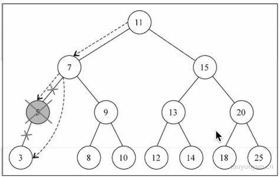

### 出现背景
在传统 web 技术上 jQuery 在页面局部刷新问题上 我们必须得关心页面各种细节 找到对应变化的节点 再操作 DOM 进行局部的刷新
而 React 不需要关注背后的状态 只要 state 发生了变化 React 就会帮你刷新局部的页面  
#### `1 个新概念` `4 个必须 Api` `单向数据流` `完善的错误提示`

### Flux 架构 




### JSX 不是模板语言 只是一种语法糖
在 JavaScript 代码中直接写 HTML 标记
```
    const name = 'Helios';
    const element = <h1>Hello, {name}</h1>
    //实际上是
    const name = 'Helios';
    const element = React.createElement(
        'h1',
        null'
        'Hello, '
        name
    );
```
### 语法糖和模板技术有什么本质区别？
两者完全不同。语法糖使得 js 语法看上去像模板，但完全不是模板引擎，不需要学习模板语法。

### JSX中使用表达式
#### JSX本身也是表达式
`const element = <h1>Hello, world!</h1>`
#### 在属性中使用表达式
`MyComment foo={1 + 2 + 3 + 4} />`
#### 延展属性 ES6
`const props = {firstName: 'Ben', lastName: 'Helo'};`
`const temp = <Temp {... props} />;`
#### 表达式最为子元素
`const element = <li>{props.message}</li>`

#### Virtual DOM JSX 运行基础
 react 组件内部维护了一个 Virtual DOM 状态 这个Virtual DOM 的状态 最终会映射到真实的 DOM 节点
 当 Virtual DOM 状态发生变化时 内部计算 Virtual DOM 的区别 产生一个 diff 最终在真实的 DOM 节点 不会整体的刷新 二是刷新diff 的部分 用一种高效的方法 比较 2 个树的 diff O(n3) 通过算法降低到 O(n) 
 `1 广度优先的分层比较`
 从根节点开始标记
 根节点一样不做任何修改
 下一层 发现 A B 2个节点的顺序发生了变化  (A 和 B 都有自己唯一的标识)
 第三层 发现 节点类型发生变化 直接删除 创建一个新的节点
发现有变化 就删除新增

`组件的 DOM 结构是相对稳定的 类型相同的兄弟节点可以被唯一标识`
相同类型的子元素 需要加入 1 个 key react 给你一个 warning
 